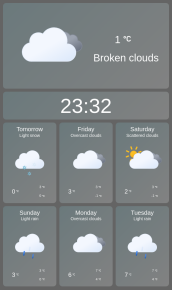

_pinion - a small cog which engages the teeth of a larger wheel_

# pinion.ecco.react.prototype 📱️🏡

An experiment in building a graphical interface for a custom weather application, that would run on an embedded microcontroller

Built using React and Redux for state management

> Example output with night theme

## Features

- Theme updates automatically based on time of day (day theme / night theme)

## Icons

Icons supplied by [@bybas/weather-icons](https://www.npmjs.com/package/@bybas/weather-icons)
